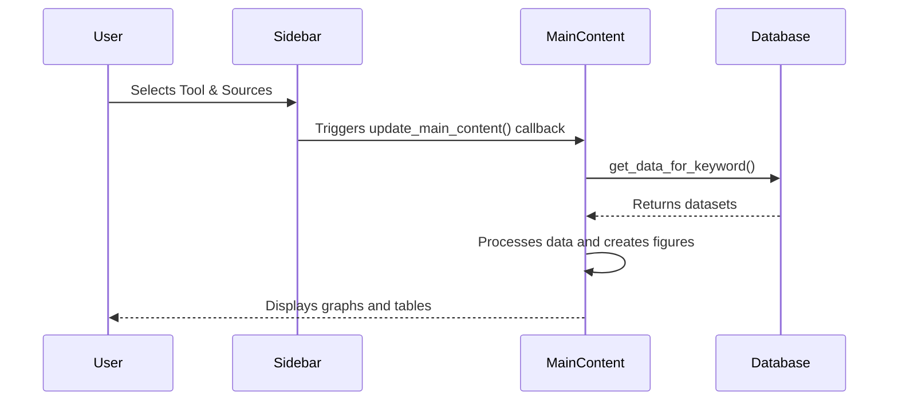
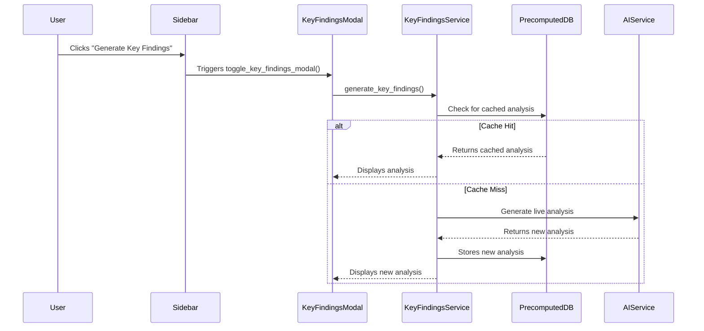

# GEMINI.md - Management Tools Analysis Dashboard

This file provides a comprehensive overview of the Management Tools Analysis Dashboard project, its architecture, and development guidelines.

## Project Overview

The Management Tools Analysis Dashboard is a Python-based web application built with Dash and Plotly. It is designed for doctoral research on management tools trends, providing interactive data visualization, statistical analysis, and AI-powered insights. The dashboard analyzes data from multiple sources, including Google Trends, Google Books, Bain & Company surveys, and Crossref.

The application is bilingual, supporting both Spanish and English. It features a "database-first" architecture, which prioritizes fetching precomputed analysis results from a SQLite database to significantly reduce latency and API costs. When a precomputed result is not available, the application falls back to a live AI call to generate the analysis.

## Architecture

The project has a modular architecture with the following key components:

*   **`dashboard_app/app.py`**: The main application file, which defines the Dash layout and callbacks.
*   **`dashboard_app/database.py`**: Manages the SQLite database, including schema creation and data retrieval.
*   **`dashboard_app/key_findings/`**: Contains the logic for the AI-powered "Key Findings" feature, including the AI service integration, database-first logic, and prompt engineering.
*   **`database_implementation/`**: Contains scripts and documentation related to the database design and implementation.
*   **Markdown Files**: The project is extensively documented in numerous markdown files that cover the project's analysis, design, implementation, and improvements.

### Data Flow

1.  **Data Ingestion**: Data from various sources is loaded into a SQLite database.
2.  **User Interaction**: The user selects a management tool and data sources through the Dash web interface.
3.  **Analysis and Visualization**: The application generates various interactive plots and statistical analyses based on the user's selection.
4.  **AI-Powered Insights**: The "Key Findings" feature generates an in-depth analysis of the selected data. It first checks for a precomputed result in the database. If not found, it calls an AI service (Groq or OpenRouter) to generate the analysis and then stores the result in the database for future use.

## `app.py` Detailed Analysis

The `dashboard_app/app.py` file is the core of the application. It defines the layout and the callbacks that handle all user interactions.

### Code Structure

*   **Imports**: The file begins with numerous imports from libraries like `dash`, `plotly`, `pandas`, and `scikit-learn`, as well as local modules.
*   **Initialization**: It initializes the Dash application, the database manager (`db_manager`), and the `KeyFindingsService`.
*   **Layout**: The application layout is defined using `dash_bootstrap_components` and is divided into a `sidebar` and a `main-content` area.
    *   **Sidebar**: Contains user controls like the `keyword-dropdown` (for selecting a management tool) and the `data-sources-container` (for selecting data sources). It also includes the "Key Findings" button and a dynamic navigation menu.
    *   **Main Content**: This area is responsible for displaying the various analyses and visualizations. It has a `dcc.Loading` component to show a spinner while content is being generated.
*   **Helper Functions**: A collection of functions responsible for creating the different plots and analyses, such as `create_temporal_2d_figure`, `create_mean_analysis_figure`, `create_3d_plot`, and more.
*   **Callbacks**: The majority of the file is dedicated to Dash callbacks. These functions are decorated with `@app.callback` and are responsible for updating the application's state and UI in response to user actions.

### Application Workflows

#### Main Content Generation

This is the primary workflow of the dashboard.



#### Key Findings Generation

This workflow is initiated when the user clicks the "Key Findings" button.



## Technical Stack

*   **Backend/Frontend**: Python, Dash, Plotly, Flask
*   **Data Manipulation**: Pandas, NumPy
*   **Database**: SQLite
*   **AI Integration**: Groq, OpenRouter
*   **Package Management**: uv (recommended), pip

## Building and Running the Project

### Prerequisites

*   Python 3.8+
*   `uv` or `pip`

### Installation and Execution

1.  **Clone the repository:**
    ```bash
    git clone <repository-url>
    cd <repository-name>
    ```

2.  **Navigate to the `dashboard_app` directory:**
    ```bash
    cd dashboard_app
    ```

3.  **Install dependencies:**
    *   **Using `uv` (recommended):**
        ```bash
        uv sync
        ```
    *   **Using `pip`:**
        ```bash
        pip install -r requirements.txt
        ```

4.  **Run the application:**
    ```bash
    uv run python app.py
    ```
    or
    ```bash
    python app.py
    ```

The application will be available at `http://127.0.0.1:8050`.

## Development Conventions

*   **Code Style**: The project follows PEP 8 for Python code.
*   **Type Hinting**: Type hints are used for function signatures and class attributes.
*   **Database**: The project uses a singleton pattern for the database manager and context managers for database connections.
*   **Configuration**: Configuration is managed through JSON files and environment variables.
*   **Documentation**: The project is extensively documented in markdown files.

For more detailed development conventions, please refer to `AGENTS.md` and `CLAUDE.md`.
