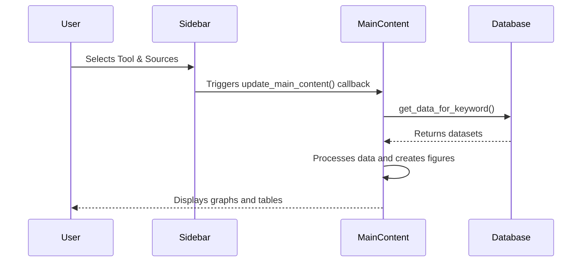
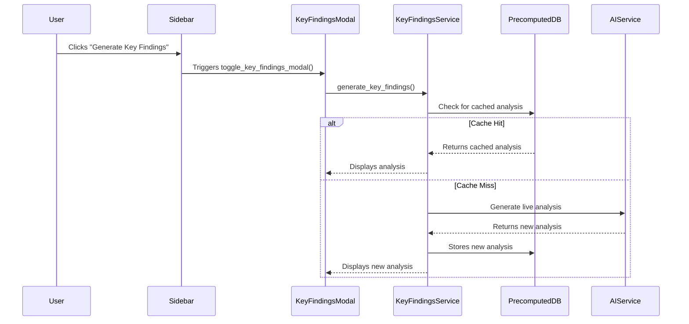

# GEMINI.md - Management Tools Analysis Dashboard

This file provides a comprehensive overview of the Management Tools Analysis Dashboard project, its architecture, and development guidelines.

## Project Overview

The Management Tools Analysis Dashboard is a Python-based web application built with Dash and Plotly. It is designed for doctoral research on management tools trends, providing interactive data visualization, statistical analysis, and AI-powered insights. The dashboard analyzes data from multiple sources, including Google Trends, Google Books, Bain & Company surveys, and Crossref.

The application is bilingual, supporting both Spanish and English. It features a "database-first" architecture, which prioritizes fetching precomputed analysis results from a SQLite database to significantly reduce latency and API costs. When a precomputed result is not available, the application falls back to a live AI call to generate the analysis.

## Architecture

The project has a modular architecture with the following key components:

*   **`dashboard_app/app.py`**: The main application file, which defines the Dash layout and callbacks.
*   **`dashboard_app/database.py`**: Manages the SQLite database, including schema creation and data retrieval.
*   **`dashboard_app/key_findings/`**: Contains the logic for the AI-powered "Key Findings" feature, including the AI service integration, database-first logic, and prompt engineering.
*   **`database_implementation/`**: Contains scripts and documentation related to the database design and implementation.
*   **Markdown Files**: The project is extensively documented in numerous markdown files that cover the project's analysis, design, implementation, and improvements.

### Data Flow

1.  **Data Ingestion**: Data from various sources is loaded into a SQLite database.
2.  **User Interaction**: The user selects a management tool and data sources through the Dash web interface.
3.  **Analysis and Visualization**: The application generates various interactive plots and statistical analyses based on the user's selection.
4.  **AI-Powered Insights**: The "Key Findings" feature generates an in-depth analysis of the selected data. It first checks for a precomputed result in the database. If not found, it calls an AI service (Groq or OpenRouter) to generate the analysis and then stores the result in the database for future use.

## Application Architecture

The dashboard follows a modular architecture with the application logic distributed across multiple focused modules. The core functionality has been refactored from a monolithic structure to a maintainable, modular design.

### Project Structure

```
dashboard_app/
├── app.py (4,407 lines) - Main application setup and orchestration
├── layout.py - UI layout components (sidebar, header, modals)
├── utils.py - Helper functions and utilities (caching, data processing)
├── database.py - Database management and connections
├── translations.py - Bilingual support system
├── tools.py - Tool definitions and management
└── callbacks/
    ├── __init__.py
    ├── ui_callbacks.py (633 lines) - UI state management and language switching
    ├── main_callbacks.py (827 lines) - Primary content generation and processing
    ├── graph_callbacks.py (1,276 lines) - Visualizations and statistical analysis
    └── kf_callbacks.py (1,036 lines) - Key Findings and AI-powered insights
```

### Code Organization

*   **app.py**: Main application entry point that initializes the Dash app, registers all callback modules, and sets up the layout. Now serves as orchestration layer rather than containing all functionality.
*   **layout.py**: Contains all UI layout components including sidebar, header, modals, and main layout structure using `dash_bootstrap_components`.
*   **utils.py**: Helper functions for data processing, caching, text parsing, dataset creation, and visualization utilities.
*   **callbacks/**: Organized callback modules:
    *   **ui_callbacks.py**: Manages UI state, language switching, button updates, and modal interactions
    *   **main_callbacks.py**: Handles the main content generation callback that processes data and creates primary dashboard content
    *   **graph_callbacks.py**: Creates all visualizations including temporal analysis, 3D plots, seasonal analysis, Fourier analysis, and regression
    *   **kf_callbacks.py**: Manages Key Findings modal and AI-powered analysis functionality

### Modular Callback Registration

Each callback module exports a `register_*_callbacks(app)` function that the main app.py calls to register callbacks with the Dash application, ensuring clean separation of concerns and maintainable code organization.

### Application Workflows

#### Main Content Generation

This is the primary workflow of the dashboard.



#### Key Findings Generation

This workflow is initiated when the user clicks the "Key Findings" button.



## Technical Stack

*   **Backend/Frontend**: Python, Dash, Plotly, Flask
*   **Data Manipulation**: Pandas, NumPy
*   **Database**: SQLite
*   **AI Integration**: Groq, OpenRouter
*   **Package Management**: uv (recommended), pip

## Building and Running the Project

### Prerequisites

*   Python 3.8+
*   `uv` or `pip`

### Installation and Execution

1.  **Clone the repository:**
    ```bash
    git clone <repository-url>
    cd <repository-name>
    ```

2.  **Navigate to the `dashboard_app` directory:**
    ```bash
    cd dashboard_app
    ```

3.  **Install dependencies:**
    *   **Using `uv` (recommended):**
        ```bash
        uv sync
        ```
    *   **Using `pip`:**
        ```bash
        pip install -r requirements.txt
        ```

4.  **Run the application:**
    ```bash
    uv run python app.py
    ```
    or
    ```bash
    python app.py
    ```

The application will be available at `http://127.0.0.1:8050`.

## Development Conventions

*   **Code Style**: The project follows PEP 8 for Python code.
*   **Type Hinting**: Type hints are used for function signatures and class attributes.
*   **Database**: The project uses a singleton pattern for the database manager and context managers for database connections.
*   **Configuration**: Configuration is managed through JSON files and environment variables.
*   **Documentation**: The project is extensively documented in markdown files.

For more detailed development conventions, please refer to `AGENTS.md` and `CLAUDE.md`.
