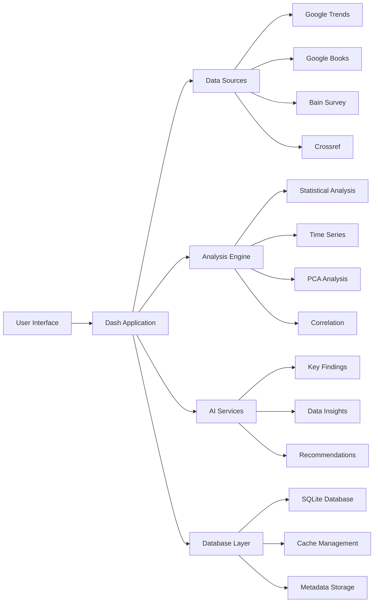
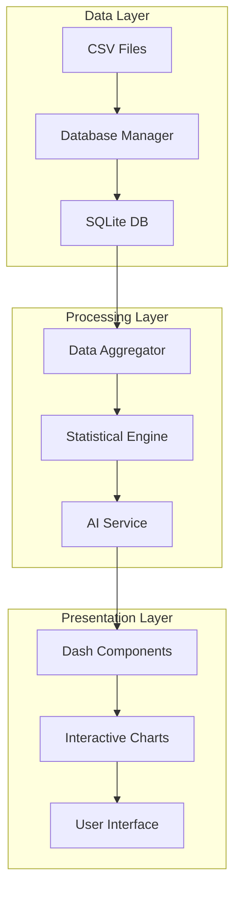
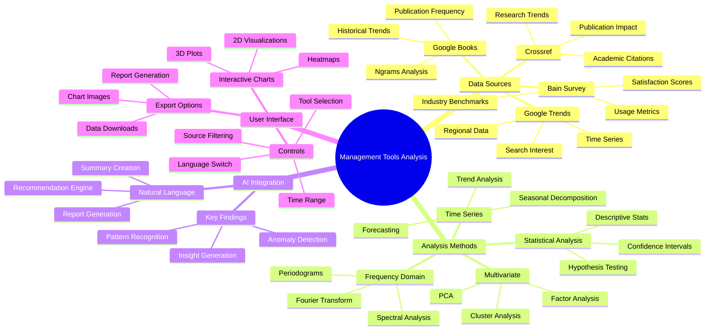
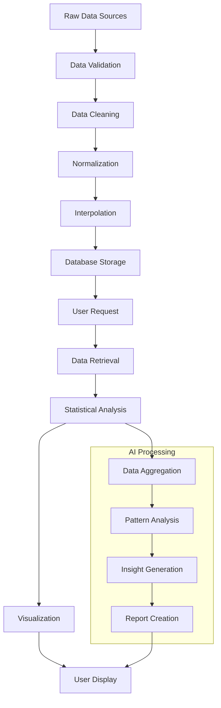
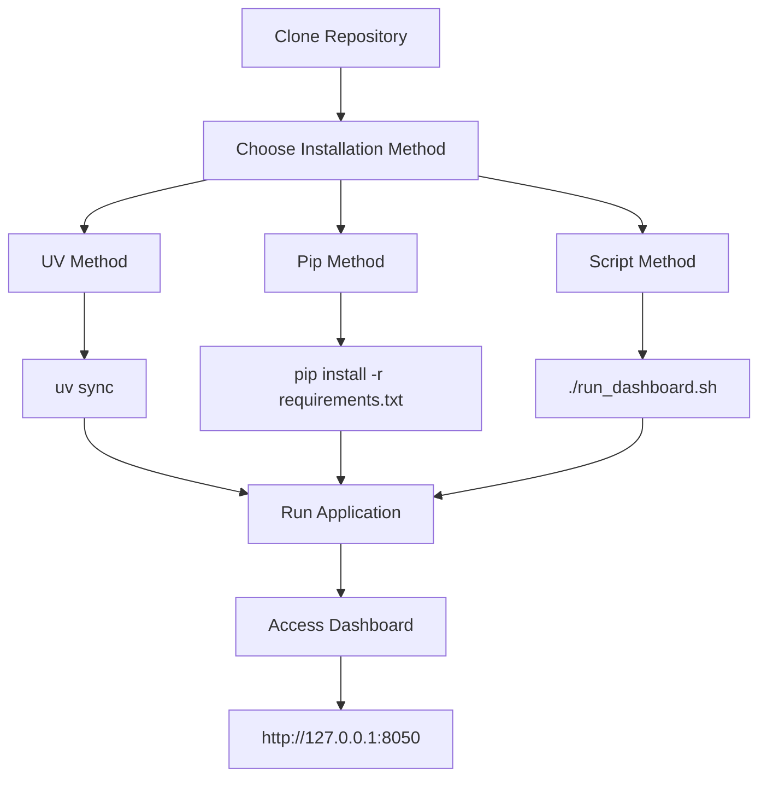
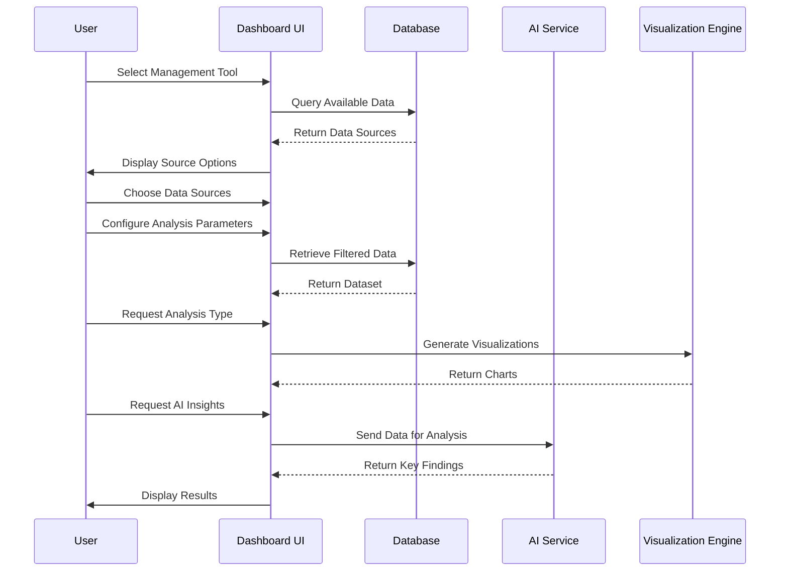
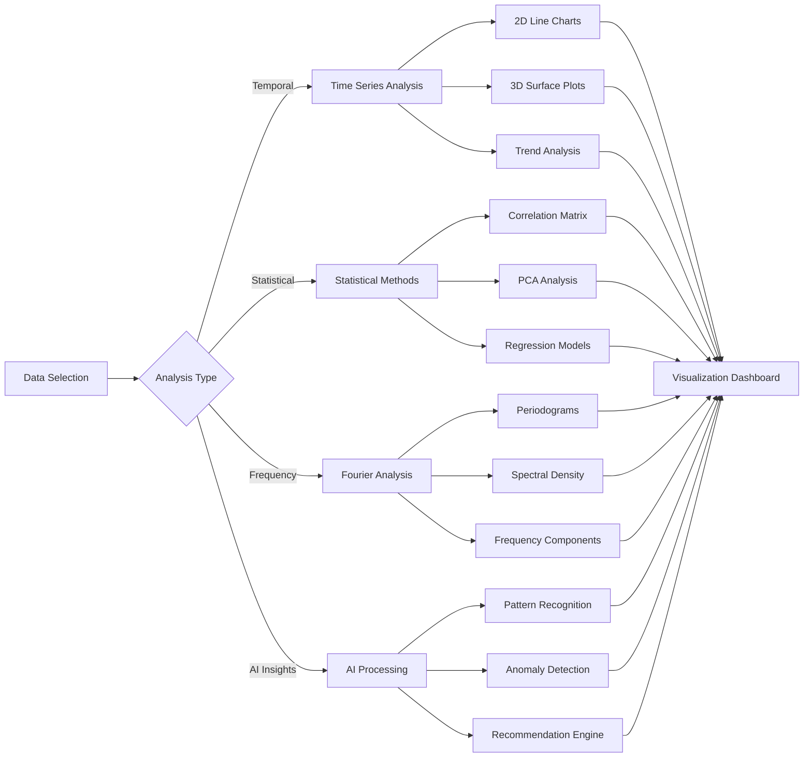
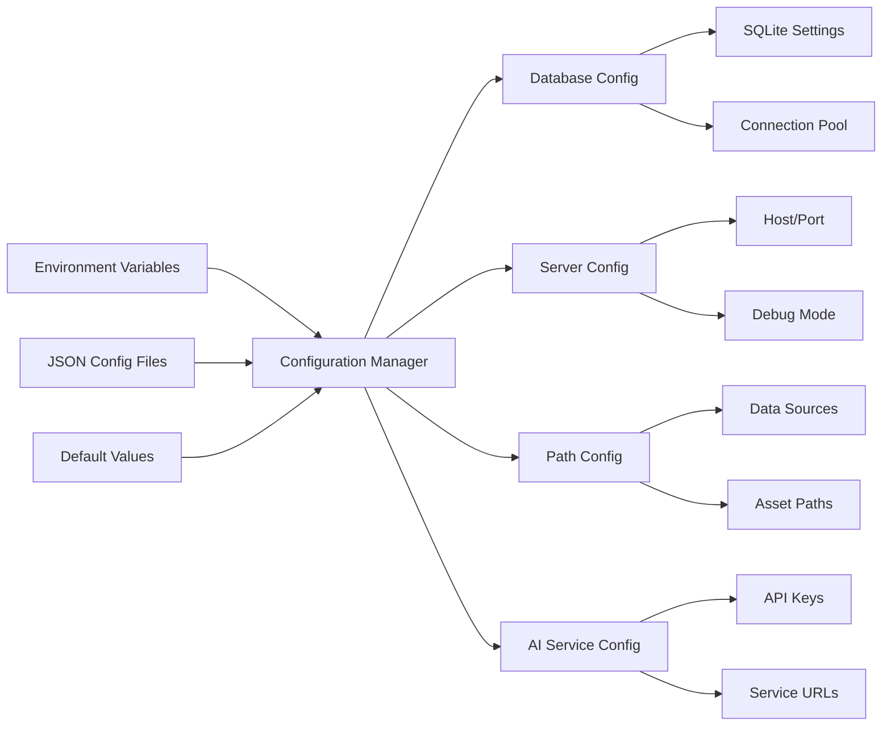
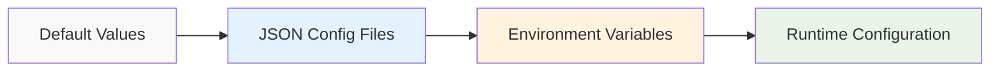

# Management Tools Analysis Dashboard

An interactive Dash application for analyzing management tools data with AI-powered insights. This dashboard provides comprehensive statistical analysis, bilingual support, and real-time data visualization for management research.

## 🎯 System Overview



## 🏗️ Architecture Flow



## 🌟 Features

### Core Functionality
- **Interactive Data Visualization**: Multi-source data analysis with real-time updates
- **Bilingual Support**: Complete Spanish/English language switching
- **AI-Powered Insights**: Automated key findings generation using multiple AI services
- **Advanced Statistical Analysis**: PCA, regression, time series, Fourier analysis
- **Responsive Design**: Mobile-friendly interface with Bootstrap components

### Data Sources
- **Google Trends**: Real-time search interest data
- **Google Books Ngrams**: Historical book publication frequency
- **Bain Management Tools Survey**: Usage and satisfaction metrics
- **Crossref**: Academic publication and citation data

### Analysis Tools
- **Temporal Analysis**: 2D and 3D time series visualization
- **Seasonal Decomposition**: Trend and seasonal pattern analysis
- **Correlation Analysis**: Heatmap visualization of relationships
- **Principal Component Analysis**: Dimension reduction and pattern discovery
- **Regression Analysis**: Linear and non-linear modeling
- **Fourier Analysis**: Frequency domain analysis and periodograms

## 🧠 Concept Map



## 🔄 Data Processing Pipeline



## 🚀 Quick Start

### Prerequisites
- Python 3.8 or higher
- `uv` package manager (recommended) or `pip`
- Git

### Installation Process Flow



### Installation

#### Method 1: Using UV (Recommended)
```bash
# Clone the repository
git clone https://github.com/Wise-Connex/management-tools-analysis-dashboard.git
cd management-tools-analysis-dashboard

# Navigate to dashboard app
cd dashboard_app

# Install dependencies
uv sync

# Run the application
uv run python app.py
```

#### Method 2: Using Pip
```bash
# Clone the repository
git clone https://github.com/Wise-Connex/management-tools-analysis-dashboard.git
cd management-tools-analysis-dashboard

# Navigate to dashboard app
cd dashboard_app

# Create virtual environment
python -m venv .venv
source .venv/bin/activate  # On Windows: .venv\Scripts\activate

# Install dependencies
pip install -r requirements.txt

# Run the application
python app.py
```

#### Method 3: Using Convenience Script
```bash
# Clone and run from project root
git clone https://github.com/Wise-Connex/management-tools-analysis-dashboard.git
cd management-tools-analysis-dashboard
./run_dashboard.sh
```

### Access the Application

Open your web browser and navigate to:
- **Local**: http://127.0.0.1:8050
- **Network**: http://your-local-ip:8050

## 📊 Usage Guide

### User Workflow Diagram



### Basic Workflow

1. **Select a Management Tool**: Choose from dropdown menu (e.g., "Benchmarking", "Calidad Total", "Cuadro de Mando Integral")
2. **Choose Data Sources**: Select which data sources to include in analysis
3. **Configure Analysis**: 
   - Select time range (5, 10, 15, 20 years or custom)
   - Choose data frequency (monthly/annual)
   - Configure visualization options
4. **View Results**: Explore different analysis tabs:
   - **Temporal Analysis**: Time series plots and trends
   - **Statistical Analysis**: Correlations, PCA, regression
   - **AI Insights**: Automated key findings and recommendations
   - **Data Table**: Raw data export and filtering

### Analysis Types Flowchart



### Advanced Features

#### AI-Powered Key Findings
- Click the "🔍 Generate Key Findings" button for AI analysis
- Supports multiple AI providers (Groq, OpenRouter)
- Provides actionable insights based on data patterns
- Includes confidence scores and source attribution

#### Data Export
- Export charts as PNG/SVG
- Download data as CSV
- Generate comprehensive reports

#### Custom Configuration
- Environment-based configuration
- Docker deployment support
- Custom interpolation profiles
- Database backup and restore

## 🛠️ Configuration

### Configuration Architecture



### Environment Variables
Create a `.env` file in project root:

```bash
# Database Configuration
DASHBOARD_DATABASE_PATH=dashboard_app/data.db

# Server Configuration  
DASHBOARD_HOST=127.0.0.1
DASHBOARD_PORT=8050
DASHBOARD_DEBUG=true

# AI Services (Optional)
GROQ_API_KEY=your_groq_api_key
OPENROUTER_API_KEY=your_openrouter_api_key

# Data Paths
DASHBOARD_DATA_SOURCES=dbase
DASHBOARD_CONFIG_DIR=config
```

### Configuration Files
The application uses JSON configuration files in `config/` directory:

- `database.json`: Database schema and connection settings
- `server.json`: Server and deployment configuration  
- `paths.json`: File paths and directory structure

### Configuration Priority



## 🐳 Docker Deployment

### Build and Run
```bash
# Build the Docker image
docker build -t management-tools-dashboard .

# Run the container
docker run -p 8050:8050 -v $(pwd)/data:/app/data management-tools-dashboard
```

### Docker Compose
```bash
# Using docker-compose
docker-compose up -d
```

## 📁 Project Structure

```
management-tools-analysis-dashboard/
├── dashboard_app/                 # Main application directory
│   ├── app.py                   # Dash application entry point
│   ├── tools.py                 # Tool definitions and mappings
│   ├── translations.py           # Bilingual support
│   ├── config.py                # Configuration management
│   ├── database.py              # Database operations
│   ├── key_findings/            # AI analysis modules
│   │   ├── ai_service.py        # AI service integration
│   │   ├── database_manager.py  # Findings database
│   │   └── key_findings_service.py # Analysis service
│   ├── assets/                  # Static assets (images, icons)
│   ├── data/                    # SQLite databases:
│   ├── requirements.txt          # Python dependencies
│   └── pyproject.toml          # UV project configuration
├── config/                      # Configuration files
├── dbase/                       # Data source files
├── run_dashboard.sh            # Convenience script
├── AGENTS.md                   # AI agent guidelines
└── README.md                   # This file
```

## 🔧 Development

### Code Style
- Follow PEP 8 for Python code formatting
- Use type hints for all functions
- Implement comprehensive error handling
- Write docstrings for all public methods
- See `AGENTS.md` for detailed coding guidelines

### Testing
```bash
# Run tests (when implemented)
python -m pytest tests/

# Test application manually
cd dashboard_app && python app.py
```

### Code Quality Tools
```bash
# Install development dependencies
uv sync --dev

# Run linting (when configured)
ruff check .
black .

# Type checking (when configured)
mypy .
```

## 📚 API Reference

### Database Manager
```python
from database import get_database_manager

db = get_database_manager()
data, sources = db.get_data_for_keyword("Benchmarking", [1, 2, 3])
```

### Configuration
```python
from config import get_config

config = get_config()
db_path = config.database_path
server_config = config.get_server_config()
```

### Translations
```python
from translations import get_text

text = get_text('select_tool', 'en')  # English
text = get_text('select_tool', 'es')  # Spanish
```

## 🤝 Contributing

1. Fork the repository
2. Create a feature branch: `git checkout -b feature-name`
3. Make your changes and test thoroughly
4. Commit your changes: `git commit -m "Add feature description"`
5. Push to the branch: `git push origin feature-name`
6. Submit a pull request

### Development Guidelines
- Follow the coding standards in `AGENTS.md`
- Add tests for new features
- Update documentation as needed
- Ensure all existing tests pass
- Use descriptive commit messages

## 🐛 Troubleshooting

### Common Issues

#### Application Won't Start
```bash
# Check Python version
python --version  # Should be 3.8+

# Check dependencies
uv sync  # or pip install -r requirements.txt

# Check database permissions
ls -la dashboard_app/data.db
```

#### Database Connection Issues
```bash
# Recreate database schema
cd dashboard_app
python -c "from database import get_database_manager; get_database_manager().create_schema()"
```

#### AI Services Not Working
```bash
# Check API keys
echo $GROQ_API_KEY
echo $OPENROUTER_API_KEY

# Verify .env file exists
ls -la .env
```

#### Port Already in Use
```bash
# Kill existing process
lsof -ti:8050 | xargs kill -9

# Or use different port
DASHBOARD_PORT=8051 python app.py
```

### Performance Optimization

- Use SSD storage for databases
- Increase memory allocation for large datasets
- Enable database WAL mode for better concurrency
- Use Redis for caching in production

## 📄 License

This project is part of doctoral research on management tools analysis. See LICENSE file for details.

## 🙏 Acknowledgments

- **Principal Investigator**: Diomar Añez (ORCID: 0000-0002-7925-5078)
- **Academic Tutor**: Dra. Elizabeth Pereira (ULAC)
- **Institution**: Solidum Consulting / Wise Connex
- **Data Sources**: Google Trends, Google Books, Bain & Company, Crossref

## 📞 Support

- **Issues**: Report bugs via GitHub Issues
- **Documentation**: See `AGENTS.md` for development guidelines
- **Data**: Available through Harvard Dataverse and NLM Dataset Catalog

## 🔗 Related Links

- **Harvard Dataverse**: [Management Fads Dataset](https://dataverse.harvard.edu/dataverse/management-fads)
- **NLM Publication**: [Dataset Catalog](https://datasetcatalog.nlm.nih.gov/searchResults?filters=agent%3AAnez%252C%2520Diomar)
- **Zenodo**: [Research Data](https://zenodo.org/search?q=metadata.creators.person_or_org.name%3A%22Anez%2C%20Diomar%22)
- **OpenAIRE**: [Research Output](https://explore.openaire.eu/search/advanced/research-outcomes?f0=resultauthor&fv0=Diomar%2520Anez)
- **GitHub Reports**: [Analysis Reports](https://github.com/Wise-Connex/Management-Tools-Analysis/tree/main/Informes)

---

**© 2024-2025 Diomar Añez - Dimar Añez. All rights reserved.**
